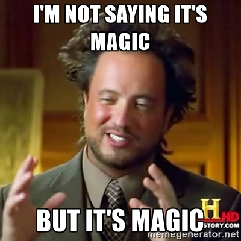

<style>
img {
  width: 100%;
}
pre {
  font-size: 1em !important;
}
</style>
# React Lima
# Workshop

---

# Who am i?

---

# @kevinsimper 🏂

---

# FROM denmark 🇩🇰

---

# front-end developer 🤓

---

# started a startup 😜

---

# did not work 😩🔫

---

# Been traveling
# Last 3 months 💸

---

- Quito
- Baños
- Cuenca
- Guayaquil
- Galapagos
- Mancora
- Trujillo
- Lima
- Cusco
- Machu Picchu
- Puno
- Arequipa
- Ica

---

# Anyways
# Let's start 😊

---

# Thinking in
# React 🤔

---

# Why React? 🤖

---

# JS was getting
# too damn difficult! 🤐

---

# DOM is slow 💤

---

# jQuery was perfect 👻

---

# The truth was in the DOM 🤕

---

## What if we could start over?
# FRESH START ALL THE time?! 😍

---

# JSX

---

# XML in JS?

---


---


---



---

```
<div className='content' />
```
## is converted to
```
React.createElement("div",
  {className: 'content'}
)
```

---

# virtualdom


---

# simple api 🛠

```
React.createClass()
ReactDOM.render()
```

---

# Components 👏

---

# Hello world 🐣

```
var HelloWorld = React.createClass({
  render: function () {
    return <div>Hello World</div>;
  }
});
```

---

# Show it to the World 🎉

---

#ReactDOM 🐒
```
ReactDOM.render(
  <HelloWorld/>,
  document.getElementById('app')
)
```

---

## Download boilerplate
`https://goo.gl/utTnhQ`
## Put it into a
`index.html`

---

# 🚀 First task:
#Hello world

---

```
var HelloWorld = React.createClass({
  render: function () {
    return <div>Hello World</div>;
  }
});
React.render(
  <HelloWorld/>,
  document.getElementById('app')
)
```

---

# Let's build a form
# not a todo app 💩

---

```
var Form = React.createClass({
  render: function () {
    return (
      <form>
        ???
      </form>
    )
  }
})
```

---

```
var Form = React.createClass({
  render: function () {
    return (
      <form>
        <input type='text' value=''/>
      </form>
    )
  }
})
```

---

# How to know when it has changed? 🙊

---

`domNode.onChange = function(e){}`

---

```
<input
  onChange={this.onInputChange} />
```

---

```
var Form = React.createClass({
  onInputChange: function (e) {
    var value = e.target.value
  },
  render: function () {
    ...
  }
})
```

---

```
this.setState({
  value: value
})
```

---

```
this.state.value
```

---

```
var Form = React.createClass({
  onInputChange: function (e) {
    var value = e.target.value
    this.setState({
      value: value
    })
  },
  ...
})
```

---

```
var Form = React.createClass({
  ...
  render: function () {
    return (
      <form>
        <input type='text'
          value={this.state.value}/>
      </form>
    )
  }
})
```

---

## 🚀 Second task
## Create a form with a input

---

## 🚀 Third task
## Create a textarea
## Create a submit button

---

# How to catch a submit event? 🙊

---

```
formDomNode.onSubmit = function (e) {}
```

---
